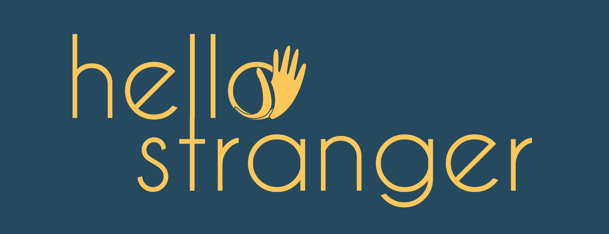

# HELLO STRANGER

# Table of contents

- [Team](#team)
- [Technology](#technology)
- [Deployed App](#deployed-app)
- [Repository](#repository)
- [Contributing](#contributing)
- [Description](#description)
- [Screenshot](#screenshot)
- [License](#license)
- [END](#end)

# Team

- Project Eagle Team Members:
  - John Nelson - https://github.com/fjnelson
  - AP - https://github.com/aashpaash
  - Helen Evans - https://github.com/HelenLEvans
  - Peter Ataras - https://github.com/poprit77
  - Davis Genthner - https://github.com/TheTrueGameBreaker
  - Chris Ridder - https://github.com/cridder

# Technology

This project was bootstrapped with [Create React App](https://github.com/facebook/create-react-app).

<!--

 -->

# Deployed App

- [ ] ADD DEPLOYED APP LINK

# Repository

[HELLO STRANGER][1]

# Contributing

Fork [HELLO STRANGER][1] and submit a pull request.

# Description

- [ ] ADD A DESCRIPTION

# Screenshot

- [ ] ADD A HOME PAGE SCREEN SHOT
- [ ] ADD A CONTENT PAGE SCREEN SHOT

# License

ISC License

Copyright (c) 2023

Permission to use, copy, modify, and/or distribute this software for any purpose with or without fee is hereby granted, provided that the above copyright notice and this permission notice appear in all copies.

THE SOFTWARE IS PROVIDED "AS IS" AND THE AUTHOR DISCLAIMS ALL WARRANTIES WITH REGARD TO THIS SOFTWARE INCLUDING ALL IMPLIED WARRANTIES OF MERCHANTABILITY AND FITNESS. IN NO EVENT SHALL THE AUTHOR BE LIABLE FOR ANY SPECIAL, DIRECT, INDIRECT, OR CONSEQUENTIAL DAMAGES OR ANY DAMAGES WHATSOEVER RESULTING FROM LOSS OF USE, DATA OR PROFITS, WHETHER IN AN ACTION OF CONTRACT, NEGLIGENCE OR OTHER TORTIOUS ACTION, ARISING OUT OF OR IN CONNECTION WITH THE USE OR PERFORMANCE OF THIS SOFTWARE.

# END

[1]: (https://github.com/fjnelson/ludicrous-speed)
